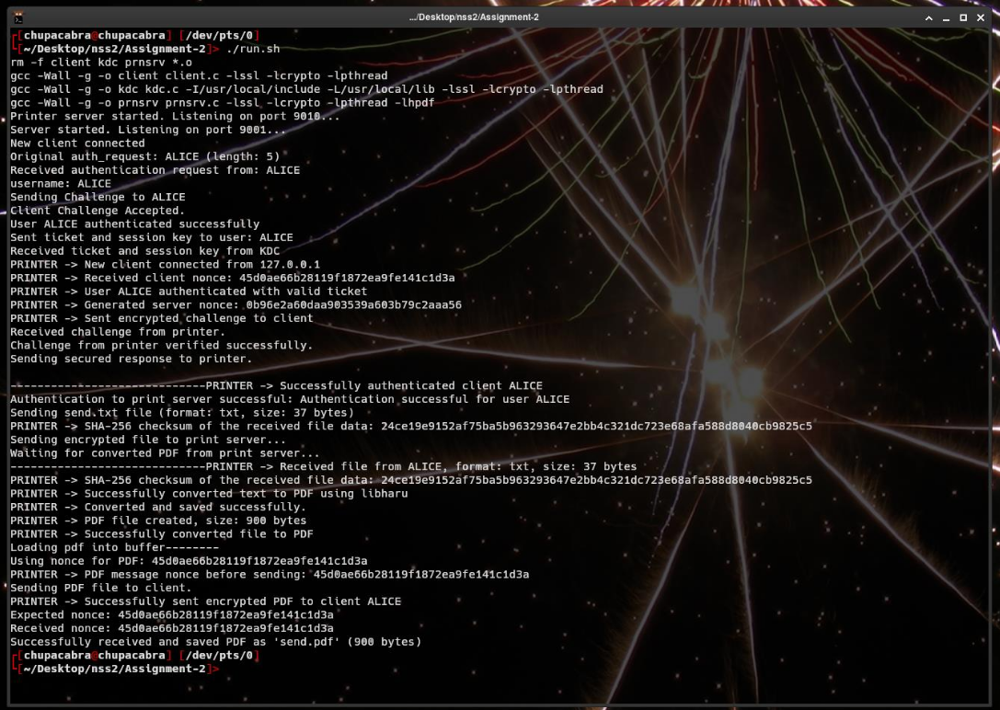

# Needham-Schroeder Based PDF Print Server

**Assignment 2: Networks and Systems Security II - Winter 2025**

A secure PDF printing service implementation using the Needham-Schroeder protocol for authentication and key distribution. This project demonstrates secure communication between a client, Key Distribution Center (KDC), and printer server.

## Project Overview

This implementation showcases a secure PDF conversion service where:
- Clients authenticate through a KDC using the Needham-Schroeder protocol
- Text files are securely transmitted to a printer server
- The printer server converts text files to PDF format
- All communications are encrypted and authenticated

## Architecture

### Components

1. **KDC (Key Distribution Center)** - `kdc.c`
   - Handles authentication requests
   - Distributes session keys using Needham-Schroeder protocol
   - Manages client and server credentials

2. **Client** - `client.c`
   - Initiates authentication with KDC
   - Sends text files to printer server
   - Handles secure communication protocols

3. **Printer Server** - `prnsrv.c`
   - Receives authenticated requests from clients
   - Converts text files to PDF format
   - Maintains secure sessions with clients

## File Structure

```
.
├── kdc.c                 # Key Distribution Center implementation
├── client.c              # Client application
├── prnsrv.c             # Printer server implementation
├── Makefile             # Build configuration
├── run.sh               # Automated setup and execution script
├── send.txt             # Sample text file for PDF conversion
└── README.md            # This file
```

## Prerequisites

- GCC compiler
- OpenSSL library (for cryptographic functions)
- Make utility
- Unix-like operating system (Linux/macOS)

## Installation & Setup

### 1. Clone the Repository

```bash
git clone <repository-url>
cd needham-schroeder-pdf-server
```

### 2. Build the Project

```bash
make
```

### 3. Run the Complete System

```bash
./run.sh
```

This script will:
- Compile all source files using the Makefile
- Start the KDC server in the background
- Start the printer server in the background
- Run the client to demonstrate the PDF conversion process

## Usage

### Quick Start

1. Ensure `send.txt` contains the text you want to convert to PDF
2. Run the automated script:
   ```bash
   ./run.sh
   ```
3. The system will generate `send.pdf` containing the converted content

### Manual Operation

If you prefer to run components individually:

```bash
# Terminal 1: Start KDC
./kdc

# Terminal 2: Start Printer Server
./prnsrv

# Terminal 3: Run Client
./client
```

## Input/Output

### Input
- **Text File**: `send.txt` (hardcoded filename)
- Contains plain text content to be converted

### Output
- **PDF File**: `send.pdf`
- Generated PDF containing the formatted text content

### Example


## Security Features

### Needham-Schroeder Protocol Implementation
- **Mutual Authentication**: Both client and server are authenticated through KDC
- **Session Key Distribution**: Secure generation and distribution of session keys
- **Replay Attack Prevention**: Timestamps and nonces prevent replay attacks
- **Encrypted Communication**: All messages between components are encrypted

### Protocol Flow
1. Client requests authentication from KDC
2. KDC generates session key and distributes it securely
3. Client establishes secure session with printer server
4. Authenticated file transfer and PDF conversion occurs

## Network Analysis

The project includes packet capture analysis showing:
- Complete loopback communication between all components
- Encrypted message exchanges
- Authentication handshakes
- Secure file transfer protocols

## Troubleshooting

### Common Issues

1. **Port Already in Use**
   ```bash
   # Kill existing processes
   pkill -f kdc
   pkill -f prnsrv
   ```

2. **Compilation Errors**
   ```bash
   # Install required dependencies
   sudo apt-get install build-essential libssl-dev
   ```

## Development

### Building Individual Components

```bash
# Compile KDC
gcc -o kdc kdc.c -lssl -lcrypto

# Compile Client
gcc -o client client.c -lssl -lcrypto

# Compile Printer Server
gcc -o prnsrv prnsrv.c -lssl -lcrypto
```

### Debugging

- Enable debug output by modifying the DEBUG flag in source files
- Use network analysis tools to examine packet flow
- Check system logs for authentication and encryption details

## Security Considerations

- Session keys are generated using cryptographically secure random number generators
- All communications use strong encryption algorithms
- The system implements proper key management and disposal
- Authentication prevents unauthorized access to the PDF conversion service

## Limitations

- Input filename is hardcoded as `send.txt`
- Single-threaded implementation
- No persistent storage of session keys
- Limited to text-to-PDF conversion only
